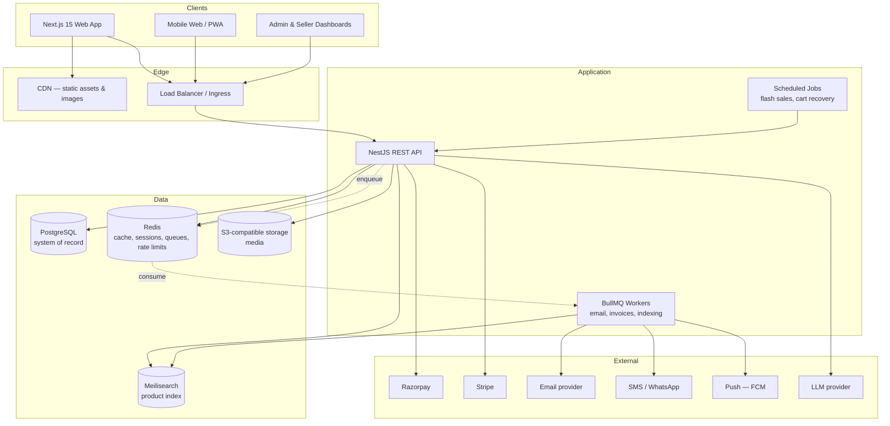
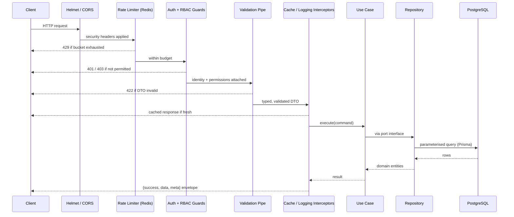
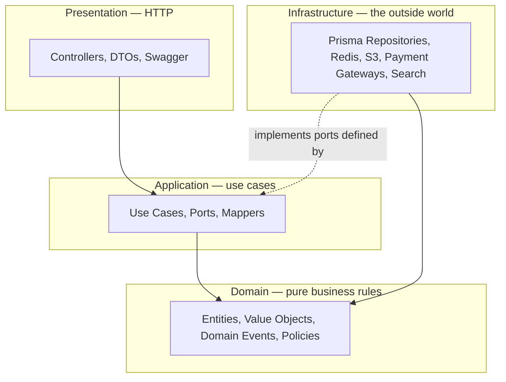
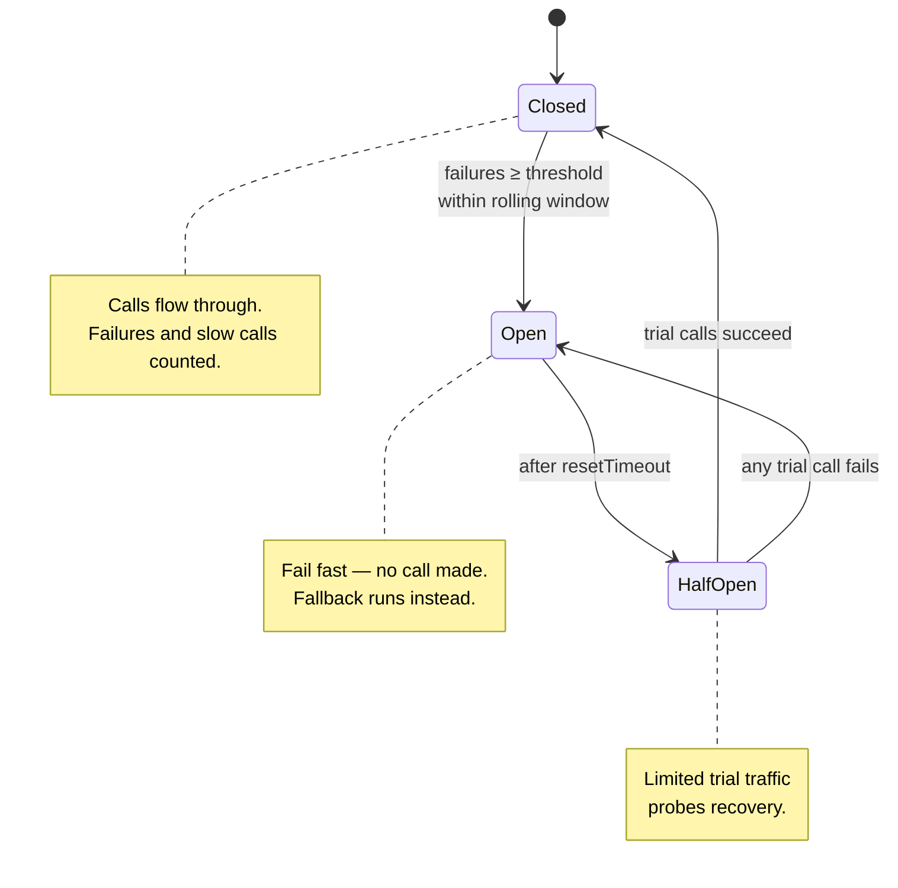

# Step 1 — Architecture

Sell-Buy is a multi-vendor commerce platform: customers buy, sellers run storefronts,
admins govern the marketplace. This document is the HLD and LLD — what the pieces are,
why they are shaped that way, and the rules that keep the codebase from rotting.

---

## 1. High-Level Design

### 1.1 System context



### 1.2 Why a modular monolith, not microservices

The API is **one deployable NestJS application composed of independent feature modules**,
each with its own domain, application, and infrastructure layers. This is a deliberate
choice, not a shortcut:

- A marketplace's core flow — cart → checkout → payment → order → inventory — needs
  **transactional consistency**. In one Postgres database that is a single `BEGIN/COMMIT`.
  Split across services it becomes a saga with compensations, and every one of those
  compensations is a bug waiting to happen.
- Module boundaries are enforced in code (a module may only touch another through its
  published application service or an event), so **each module can be extracted into its own
  service later without rewriting its internals**. The seams are already drawn.
- Work that does not need to be synchronous — email, SMS, invoice PDFs, search indexing,
  recommendation recomputation — is already off the request path in **BullMQ queues**. That
  is where the real scaling win is, and it does not require splitting the deployment.

The extraction candidates, in the order they would earn it: search indexing, notifications,
recommendations, then payments.

### 1.3 Request lifecycle

Every request passes through the same ordered pipeline. Order matters — cheap rejections
happen before expensive work.



---

## 2. Clean Architecture

### 2.1 The layers



**The dependency rule: source code dependencies point inward, always.**

- `domain/` imports nothing from the framework. No NestJS, no Prisma, no HTTP. It is plain
  TypeScript expressing business rules, and it is trivially unit-testable.
- `application/` orchestrates the domain. It declares **ports** (interfaces) for everything it
  needs from the outside — `IOrderRepository`, `IPaymentGateway`, `INotificationSender`.
- `infrastructure/` implements those ports. Prisma lives here and nowhere else.
- `presentation/` maps HTTP to use cases. Controllers contain no business logic — if a
  controller has an `if` about business rules, it is in the wrong layer.

The payoff is concrete: swapping Razorpay for Stripe, Postgres for anything else, or REST for
gRPC touches exactly one layer.

### 2.2 Feature module anatomy

Every feature module has the same shape, so a developer who has read one has read all of them:

```
modules/orders/
├── domain/
│   ├── entities/order.entity.ts          # business rules: can this order be cancelled?
│   ├── value-objects/money.vo.ts
│   ├── events/order-placed.event.ts
│   └── ports/order.repository.port.ts    # the interface the domain needs
├── application/
│   ├── use-cases/place-order.use-case.ts # one class, one transaction, one job
│   ├── dto/place-order.dto.ts
│   └── mappers/order.mapper.ts           # persistence model ⇄ domain entity
├── infrastructure/
│   └── repositories/order.prisma.repository.ts
└── presentation/
    ├── orders.controller.ts
    └── orders.module.ts                  # wires ports to implementations
```

---

## 3. SOLID, concretely

Not as slogans — as the specific decisions in this codebase.

| Principle | Where it shows up |
| --- | --- |
| **Single Responsibility** | One use case per class. `PlaceOrderUseCase` places orders; it does not send email, generate the invoice, or reindex search — it emits `OrderPlacedEvent` and handlers do those. Each has one reason to change. |
| **Open/Closed** | Adding a payment method means adding a class implementing `IPaymentGateway` and registering it in `PaymentGatewayFactory`. No existing file changes. Same for notification channels and storage backends. |
| **Liskov Substitution** | Every `IPaymentGateway` honours the same contract — same success shape, same typed failures. Callers never branch on which gateway they got, so any implementation can substitute for another. |
| **Interface Segregation** | Ports are narrow and role-based. `IOrderReader` (queries) is separate from `IOrderWriter` (mutations); a read-only reporting use case depends only on the reader and cannot accidentally write. |
| **Dependency Inversion** | Use cases depend on port interfaces, never concretions. NestJS DI binds the implementation at module wiring time via injection tokens, so the arrow points from infrastructure to application, not the reverse. |

---

## 4. Design patterns in use

Each is here because it solves a real problem in this system, not to fill a checklist.

| Pattern | Applied to | Problem it solves |
| --- | --- | --- |
| **Repository** | All persistence | Use cases speak in domain entities; Prisma stays quarantined in infrastructure. Tests use an in-memory repository, no database needed. |
| **Strategy** | Payment methods, shipping cost, discounts | Each algorithm is interchangeable behind one interface. Adding "Buy 1 Get 1" does not touch the checkout use case. |
| **Factory** | `PaymentGatewayFactory`, `NotificationChannelFactory` | Selects the right implementation at runtime from a method enum, with the resolution rule in exactly one place. |
| **Adapter** | Razorpay, Stripe, S3, Meilisearch, FCM | Third-party SDKs have wildly different shapes. Adapters normalise them to our port, so vendor quirks never leak into the domain. |
| **Builder** | `ProductQueryBuilder`, `OrderQueryBuilder` | Catalog filtering has a combinatorial explosion of optional filters, facets and sorts. A fluent builder composes them without a 200-line conditional. |
| **Singleton** | `PrismaService`, `RedisService`, config | One connection pool per process. NestJS providers are singletons by default; these additionally manage their own lifecycle hooks. |
| **Decorator** | `@Roles`, `@Permissions`, `@Public`, `@RateLimit`, `@Cacheable` | Cross-cutting concerns declared where they apply, read by guards and interceptors. |
| **Observer** | Domain events (`OrderPlacedEvent`) | Decouples "what happened" from "who cares". New reactions are new listeners, not edits to the use case. |
| **Chain of Responsibility** | The guard/interceptor/pipe pipeline | Each link handles its concern or passes along. |
| **Unit of Work** | `PrismaTransactionManager` | A use case spanning several repositories commits or rolls back as one atomic operation. |
| **Specification** | Cart and coupon eligibility rules | Composable, individually testable predicates (`IsFirstOrder AND CartAbove(500)`) instead of nested conditionals. |
| **Circuit Breaker** | Every outbound third-party call | Stops hammering a dead dependency and fails fast. Detailed below. |

---

## 5. Resilience

### 5.1 Rate limiting

Three tiers, all backed by Redis so limits are **global across every API pod**, not per-process.
The algorithm is a **sliding window** implemented as an atomic Lua script — one round trip, no
race between check and increment, and no burst at window boundaries the way fixed windows allow.

| Tier | Scope | Default budget | Rationale |
| --- | --- | --- | --- |
| **Global** | Per IP | 300 req / min | Blunt DDoS and scraper protection. |
| **Authenticated** | Per user ID | 1 000 req / min | Real users are cheap; identity is a better key than IP behind NAT. |
| **Sensitive** | Per route + identifier | `login` 5/min, `otp` 3/5min, `forgot-password` 3/hr, `payment` 10/min | Credential stuffing and OTP-bombing protection. Keyed by **email/phone as well as IP**, so rotating IPs does not reset the budget on a targeted account. |

Every limited response carries `X-RateLimit-Limit`, `X-RateLimit-Remaining`,
`X-RateLimit-Reset` and, on rejection, `Retry-After`. Limits are declared per route with
`@RateLimit({...})` — the policy sits next to the endpoint it protects.

### 5.2 Circuit breaker

Payment gateways, SMS providers and search all fail eventually. Without a breaker, a dependency
timing out at 30s turns into exhausted connection pools and a **cascading failure** — the classic
way one vendor's outage takes down an entire checkout.



Per-dependency policy, because their failure profiles differ:

| Dependency | Threshold | Timeout | Reset | Fallback when open |
| --- | --- | --- | --- | --- |
| Razorpay / Stripe | 5 failures / 60s | 10s | 30s | Try the other gateway; offer COD |
| Meilisearch | 10 failures / 60s | 3s | 20s | Degrade to Postgres `ILIKE` search |
| Email / SMS | 5 failures / 30s | 5s | 60s | Re-queue with backoff |
| LLM provider | 3 failures / 60s | 15s | 120s | Fall back to rules-based recommendations |

Combined with **exponential backoff plus jitter** on retries (so recovering services are not
hit by a synchronised thundering herd) and idempotency keys on every payment call, so a retry
can never double-charge.

### 5.3 Failure isolation

- **Timeouts everywhere.** Every outbound call has one. An unbounded call is an outage.
- **Bulkheads.** Queue concurrency is capped per job type, so a flood of invoice generation
  cannot starve OTP delivery.
- **Graceful degradation.** Search falls back to Postgres, recommendations to trending,
  the recommendation carousel disappears rather than breaking the page.
- **Idempotency.** Payment webhooks and order placement accept an idempotency key; replays
  return the original result instead of creating duplicates.

---

## 6. Security

| Threat | Control |
| --- | --- |
| SQL injection | Prisma parameterises everything. Raw SQL is banned outside audited repository methods. |
| XSS | React escapes by default; CSP headers via Helmet; user HTML sanitised on write. |
| CSRF | Refresh token in a `SameSite=Strict; HttpOnly; Secure` cookie; access token in memory (never `localStorage`); double-submit token on cookie-authenticated mutations. |
| Credential stuffing | Sensitive-tier rate limits, Argon2id hashing, account lockout with exponential backoff. |
| Token theft | 15-minute access tokens; rotating refresh tokens with **reuse detection** — a replayed refresh token revokes the entire family and forces re-login. |
| Privilege escalation | RBAC checked server-side on every request. Ownership is verified against the record, never trusted from the payload. |
| Mass assignment | DTOs whitelist fields; `forbidNonWhitelisted` rejects unknown keys outright. |
| Sensitive data exposure | Card data never touches our servers — gateway tokenisation only. PII encrypted at rest, redacted in logs. |
| Enumeration | Login, forgot-password and OTP return identical responses and timing whether or not the account exists. |

---

## 7. Performance

**Caching** — layered, each with an explicit invalidation trigger. Cache without an
invalidation story is just a bug with a delay.

| Layer | TTL | Invalidated by |
| --- | --- | --- |
| CDN (images, static) | 1 year, content-hashed | New deploy / new object key |
| Product detail (Redis) | 10 min | `product.updated` event |
| Category tree (Redis) | 1 hour | Category mutation |
| Search facets (Redis) | 5 min | TTL only |
| Session / permissions (Redis) | Token lifetime | Logout, role change |
| Cart (Redis, write-through to Postgres) | 30 days | Checkout completion |

Stampede protection: single-flight locks on cache misses, so one thousand simultaneous misses
produce one database query, not a thousand.

**Database** — indexes on every foreign key and every filter/sort column; composite indexes
matching real query shapes; cursor pagination for infinite scroll (offset pagination degrades
badly past a few thousand rows); `SELECT` only the columns needed; read replicas for analytics.

**API** — gzip/brotli compression, ETags, cursor pagination, field selection, and `DataLoader`
batching to kill N+1 queries.

---

## 8. Observability

Structured JSON logs with a correlation ID threaded from edge to database. RED metrics (Rate,
Errors, Duration) per endpoint, plus business metrics — checkout conversion, payment success
rate per gateway, cart abandonment. OpenTelemetry traces across HTTP → use case → repository →
external call. Health endpoints: `/health/live` (is the process up) and `/health/ready` (are
Postgres, Redis and the queues reachable) — Kubernetes needs both and they are not the same
question.

---

## 9. Documents in this set

| Document | Contents |
| --- | --- |
| `01-architecture.md` | This document — HLD, LLD, patterns, resilience |
| `02-database.md` | ER diagram, schema design notes, indexing strategy |
| `03-sequence-diagrams.md` | Checkout, auth, refresh rotation, returns, search |
| `04-deployment.md` | Docker, Kubernetes, CI/CD, scaling |
| `05-folder-structure.md` | Full tree with the rule for where code goes |
