# Step 2 — Database

PostgreSQL, modelled in Prisma. Full schema: [`apps/api/prisma/schema.prisma`](../apps/api/prisma/schema.prisma).

## ER diagram

```mermaid
erDiagram
    USER ||--o{ USER_ROLE : has
    ROLE ||--o{ USER_ROLE : "granted via"
    ROLE ||--o{ ROLE_PERMISSION : holds
    PERMISSION ||--o{ ROLE_PERMISSION : "granted via"
    USER ||--o{ SESSION : "signs in on"
    USER ||--o{ ADDRESS : owns
    USER ||--|| WALLET : has
    WALLET ||--o{ WALLET_TRANSACTION : records
    USER ||--o{ SAVED_CARD : tokenises
    USER ||--o| SELLER : "may be"

    SELLER ||--o{ PRODUCT : lists
    SELLER ||--o{ WAREHOUSE : operates
    SELLER ||--|| SELLER_BANK_ACCOUNT : "paid to"
    SELLER ||--o{ PAYOUT : receives

    CATEGORY ||--o{ CATEGORY : "parent of"
    CATEGORY ||--o{ PRODUCT : classifies
    BRAND ||--o{ PRODUCT : brands

    PRODUCT ||--o{ PRODUCT_VARIANT : "sold as"
    PRODUCT ||--o{ PRODUCT_OPTION : "configured by"
    PRODUCT ||--o{ PRODUCT_MEDIA : shows
    PRODUCT ||--o{ PRODUCT_SPECIFICATION : describes
    PRODUCT_OPTION ||--o{ PRODUCT_OPTION_VALUE : offers
    PRODUCT_OPTION_VALUE ||--o{ VARIANT_OPTION_VALUE : "combines into"
    PRODUCT_VARIANT ||--o{ VARIANT_OPTION_VALUE : "defined by"

    PRODUCT_VARIANT ||--o{ INVENTORY_ITEM : "stocked as"
    WAREHOUSE ||--o{ INVENTORY_ITEM : holds
    INVENTORY_ITEM ||--o{ INVENTORY_MOVEMENT : "audited by"

    USER ||--o{ CART : owns
    CART ||--o{ CART_ITEM : contains
    PRODUCT_VARIANT ||--o{ CART_ITEM : "added as"

    USER ||--o{ ORDER : places
    ORDER ||--o{ ORDER_ITEM : contains
    ORDER ||--o{ ORDER_STATUS_HISTORY : "tracked by"
    ORDER ||--o{ SHIPMENT : "shipped in"
    ORDER ||--|| INVOICE : "billed by"
    ORDER ||--o{ PAYMENT : "paid by"
    PRODUCT_VARIANT ||--o{ ORDER_ITEM : "sold as"
    SELLER ||--o{ ORDER_ITEM : fulfils

    PAYMENT ||--o{ REFUND : "refunded by"
    ORDER ||--o{ RETURN_REQUEST : "returned via"
    ORDER_ITEM ||--o{ RETURN_REQUEST : "item returned"
    RETURN_REQUEST ||--o{ REFUND : triggers

    COUPON ||--o{ COUPON_REDEMPTION : "used as"
    ORDER ||--o{ COUPON_REDEMPTION : applies
    OFFER ||--o{ OFFER_PRODUCT : discounts
    PRODUCT_VARIANT ||--o{ OFFER_PRODUCT : "on deal"

    PRODUCT ||--o{ REVIEW : "reviewed by"
    USER ||--o{ REVIEW : writes
    ORDER_ITEM ||--o{ REVIEW : verifies
    REVIEW ||--o{ REVIEW_MEDIA : shows
    REVIEW ||--o{ REVIEW_VOTE : "voted on"

    USER ||--o{ WISHLIST_ITEM : saves
    USER ||--o{ RECENTLY_VIEWED : browses
    USER ||--o{ NOTIFICATION : receives
    USER ||--o{ DEVICE_TOKEN : "pushed to"
    USER ||--o{ AUDIT_LOG : "acted in"
```



## Design decisions

### Money is `Decimal(12,2)`, never `Float`

`0.1 + 0.2 !== 0.3` in IEEE-754. Across a few million order lines that becomes a
reconciliation nightmare that no one can explain. Postgres `NUMERIC` is exact. In the domain
layer money is additionally wrapped in a `Money` value object holding integer paise, so
arithmetic cannot drift even in memory.

### Variants own price and stock, products do not

A product is a marketing concept ("iPhone 15"); a **variant** is what someone actually buys
("iPhone 15, Blue, 256 GB"). Price, SKU, barcode and inventory hang off the variant. Putting
price on the product is the single most common commerce-schema mistake, and it is discovered
the first time two sizes need different prices — by which point orders reference the wrong
thing.

Options are normalised (`ProductOption` → `ProductOptionValue` → `VariantOptionValue`) rather
than hardcoded colour/size columns, so a laptop can have "RAM" and "Storage" while a shirt has
"Colour" and "Size", with the same variant picker rendering both.

### Orders snapshot everything

`OrderItem` copies the title, SKU, image, unit price and tax rate; `Order` copies the whole
shipping address as JSON. An order is a **historical record**, not a live view. If a seller
renames a product or a customer edits their address, an invoice from last year must still
reproduce exactly what was sold and where it went — that is a legal requirement, not a nicety.

### `quantity` and `reserved` are separate

Available stock is `quantity − reserved`. Between order creation and payment capture the units
are reserved, not deducted: the customer may abandon the gateway page. A scheduled sweep
releases reservations older than 15 minutes.

Deducting immediately loses inventory to abandoned checkouts; deducting only on capture
oversells, because two buyers can both pass the stock check in the gap. Reservation is the only
model that is correct in both directions.

### Sellers are on the order item, not the order

One cart can span several sellers. Each line is fulfilled, paid out and returned independently,
so `sellerId` is denormalised onto `OrderItem` — which is also what makes the seller dashboard
a single indexed lookup rather than a join through orders.

### Denormalised aggregates where reads dominate

`Product.ratingAverage`, `ratingCount` and `totalSold` are maintained on write. A 50-item
category grid would otherwise run 50 aggregate subqueries per page load. They are recomputed by
a nightly job as a safety net against drift.

### Append-only tables

`InventoryMovement`, `WalletTransaction`, `OrderStatusHistory` and `AuditLog` are never updated
or deleted. When stock, balance or an order status is disputed, the ledger answers *how* it got
there — a mutable row only tells you where it ended up.

### Idempotency is in the schema, not just the code

`Order.idempotencyKey`, `Payment.idempotencyKey`, `Refund.idempotencyKey` and
`WebhookEvent(gateway, eventId)` are all unique. Gateways retry webhooks aggressively and
networks drop responses; the database is the last line of defence against a double charge, and
it is the one place the guarantee cannot be bypassed by a bug in application code.

## Indexing

Every foreign key is indexed — Postgres does **not** do this automatically, and an unindexed FK
turns cascading deletes and joins into sequential scans.

Composite indexes match real query shapes rather than single columns:

| Index | Serves |
| --- | --- |
| `products(categoryId, status, deletedAt)` | Category listing — the hottest query on the site |
| `products(sellerId, status)` | Seller dashboard |
| `orders(userId, placedAt)` | "My orders", newest first |
| `order_items(sellerId, createdAt)` | Seller order feed |
| `sessions(userId, revokedAt)` | Active-device list and logout-all |
| `product_specifications(key, value)` | Spec-based filters ("RAM = 16GB") |
| `carts(status, updatedAt)` | Abandoned-cart sweep |

Column order matters: equality columns first, range/sort column last, so the index can be used
for both filtering and ordering in one pass.

## Commands

```bash
npm run db:migrate      # create and apply a migration in development
npm run db:migrate:deploy   # apply pending migrations in CI/production
npm run db:seed         # roles, permissions, demo catalog
npm run db:studio       # browse the data
```

Migrations follow **expand/contract**: add nullable, backfill, switch reads, drop old in a
later release. A rollback must never land on a schema the previous version cannot read.
