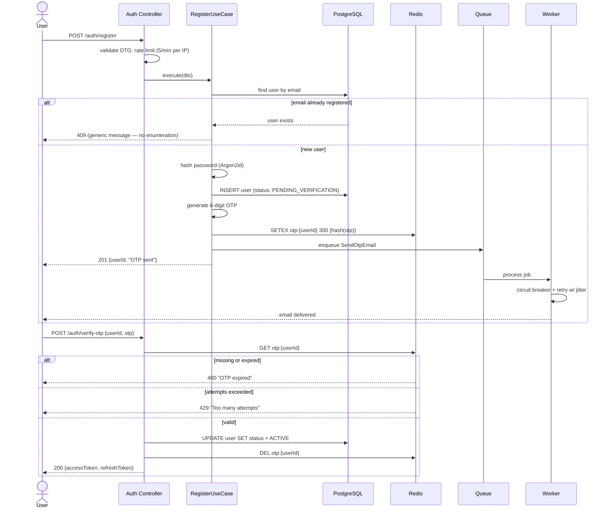
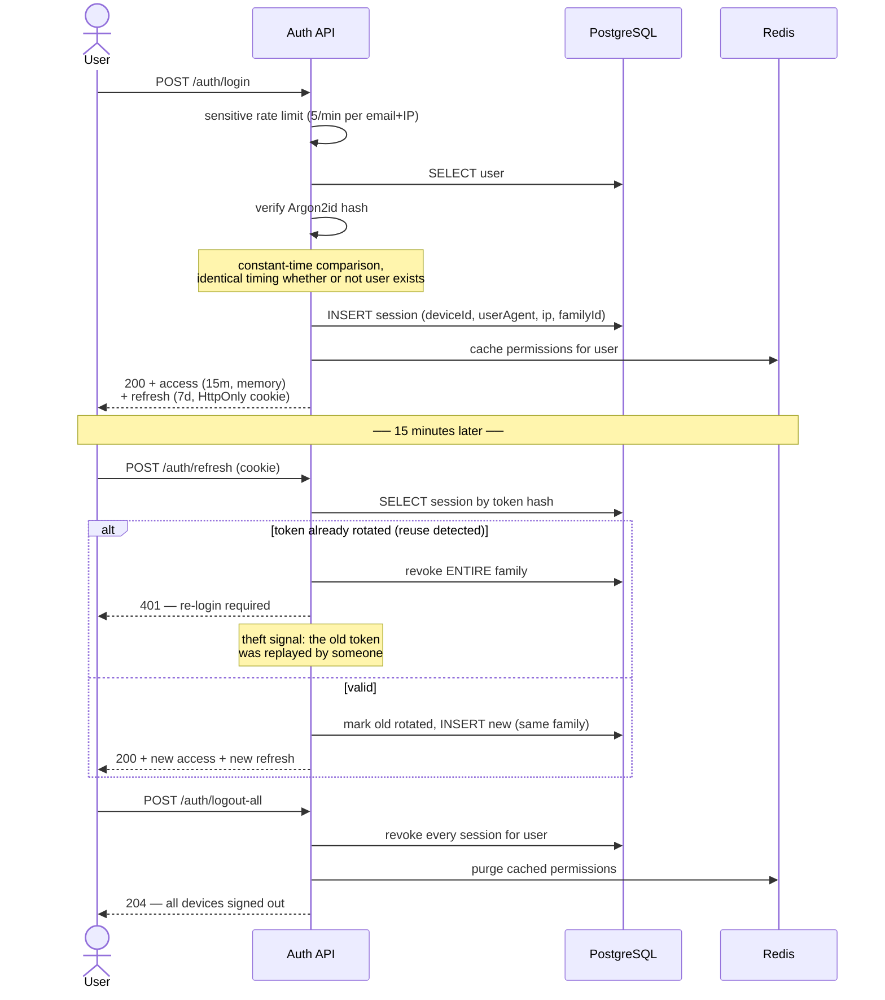
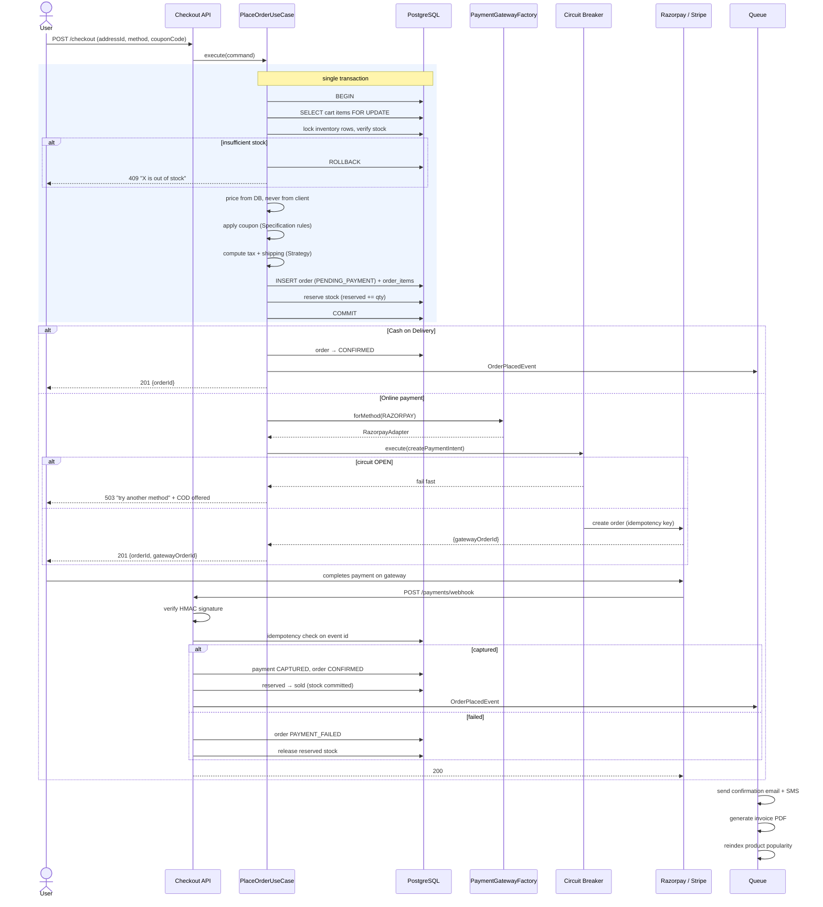
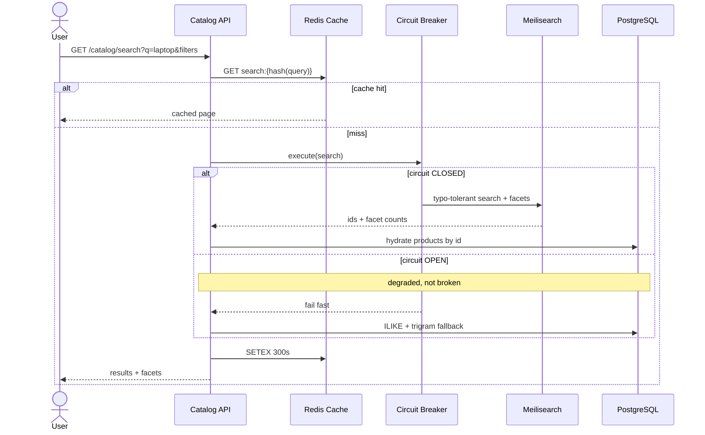

# Sequence Diagrams

The flows where the details actually matter.

---

## 1. Registration with OTP verification



---

## 2. Login and refresh token rotation

Refresh tokens rotate on every use and are tracked as a **family**. If a token that has already
been used shows up again, it was stolen — the whole family is revoked.



---

## 3. Checkout and payment

The critical path. Note what happens **inside** the transaction versus after it.



**Why stock is reserved, not decremented:** between order creation and payment capture the
customer may abandon the gateway page. Reserved stock is released by a scheduled sweep after
15 minutes, so abandoned checkouts do not permanently consume inventory — and concurrent buyers
still cannot oversell, because the reservation holds the row.

---

## 4. Product search with graceful degradation



---

## 5. Return and refund

```mermaid
sequenceDiagram
    actor U as Customer
    participant API as Orders API
    participant DB as PostgreSQL
    participant CB as Circuit Breaker
    participant PG as Payment Gateway
    actor A as Admin

    U->>API: POST /orders/{id}/return
    API->>DB: load order
    API->>API: OrderPolicy.canReturn() — delivered, within window, not already returned
    alt not eligible
        API-->>U: 422 with the specific reason
    else eligible
        API->>DB: INSERT return_request (REQUESTED)
        API-->>U: 201
    end

    A->>API: PATCH /admin/returns/{id} {APPROVED}
    API->>DB: status → APPROVED, schedule pickup
    Note over A,DB: item picked up and inspected
    A->>API: PATCH /admin/returns/{id} {RECEIVED}

    API->>DB: INSERT refund (PENDING)
    API->>CB: execute(refund, idempotencyKey)
    CB->>PG: refund
    alt success
        PG-->>API: refundId
        API->>DB: refund COMPLETED, return REFUNDED
        API->>DB: restock inventory
    else failure
        API->>DB: refund FAILED — queued for retry
        Note over API: never silently lose a refund;<br/>alert + manual queue
    end
```
