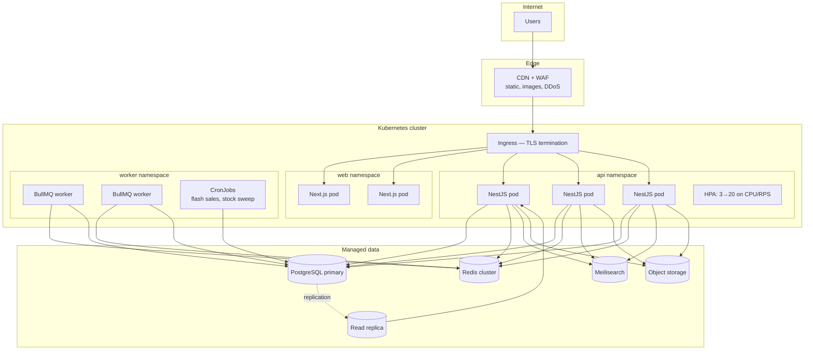
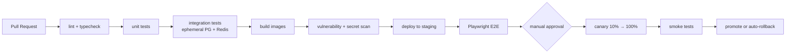

# Deployment

## Topology



## Local development

```bash
cp .env.example .env
docker compose up -d postgres redis meilisearch minio mailhog
npm install
npm run db:migrate && npm run db:seed
npm run dev
```

| Service | URL |
| --- | --- |
| Web | http://localhost:3000 |
| API | http://localhost:4000 |
| Swagger | http://localhost:4000/api/docs |
| Meilisearch | http://localhost:7700 |
| MinIO console | http://localhost:9001 |
| Mailhog (catches all outbound email) | http://localhost:8025 |

## Images

Multi-stage builds, non-root user, distroless-style runtime. The API image runs migrations via
a Kubernetes **Job** before the rollout — never on pod start, or ten pods race the same
migration.

```dockerfile
FROM node:22-alpine AS deps
# ... install with lockfile, cached separately from source

FROM node:22-alpine AS build
# ... prisma generate && nest build

FROM node:22-alpine AS runtime
USER node
HEALTHCHECK CMD node dist/health-check.js
CMD ["node", "dist/main.js"]
```

## Kubernetes

Each service ships with:

- **Probes** — `/health/live` (restart if failing) and `/health/ready` (pull from load balancer
  if dependencies are down). Different questions, different endpoints.
- **Resource requests and limits** — requests sized to p50, limits to p99. No limit means one
  bad pod can starve the node.
- **HPA** on CPU and requests-per-second.
- **PodDisruptionBudget** so a node drain cannot take every replica at once.
- **Rolling updates** with `maxUnavailable: 0` — capacity never dips during deploy.
- **Secrets** from a secrets manager (External Secrets Operator), never from a ConfigMap.
- **Graceful shutdown** — `SIGTERM` stops accepting new work, drains in-flight requests,
  finishes running jobs, then exits. `terminationGracePeriodSeconds: 30`.

## CI/CD



Every merge to `main` is deployable. Migrations are **expand/contract** — add nullable column,
backfill, switch reads, drop old column in a later release — so a rollback never lands on a
schema the previous version cannot read.

## Scaling path

| Bottleneck | First move |
| --- | --- |
| Read-heavy catalog | Read replicas + longer Redis TTLs |
| Write-heavy orders | Partition `orders` and `order_items` by month |
| Search load | Scale Meilisearch independently; it is already isolated by a breaker |
| Notification spikes | Scale workers; queues absorb the burst |
| Global latency | Multi-region read replicas + regional CDN |

## Backups and DR

Postgres PITR with 30-day retention and **restores rehearsed quarterly** — an untested backup
is not a backup. Redis is treated as disposable except for queues (AOF enabled). Object storage
is versioned with cross-region replication. Targets: **RPO 5 minutes, RTO 1 hour.**
